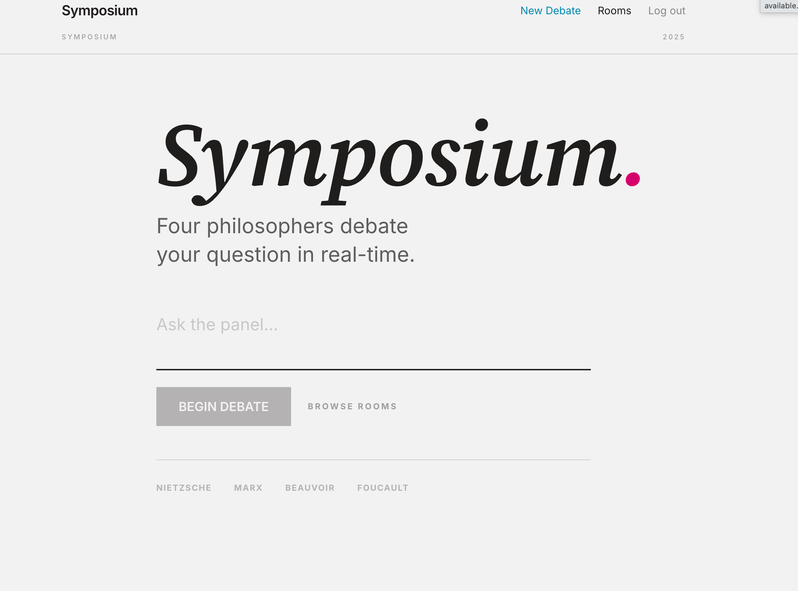
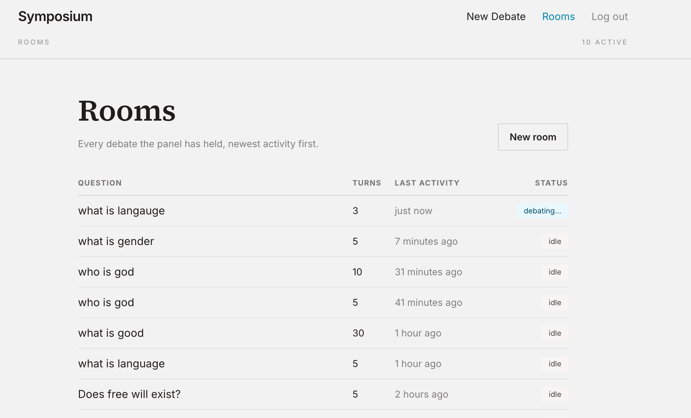
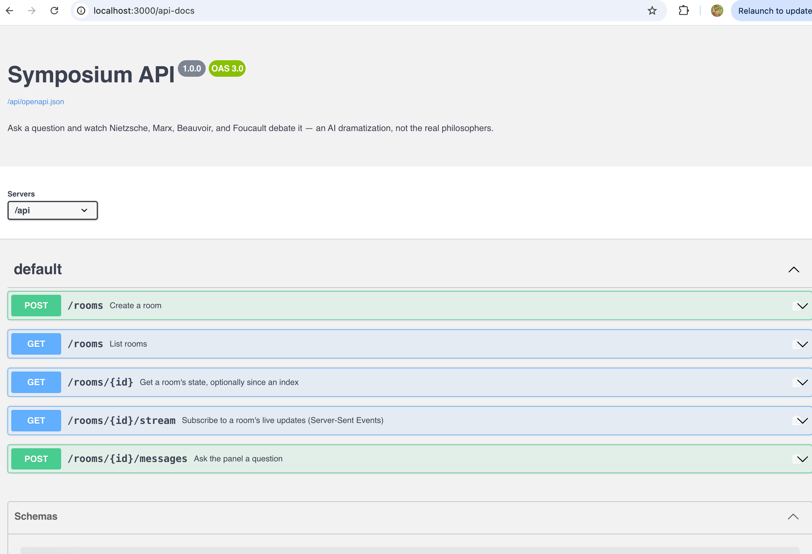
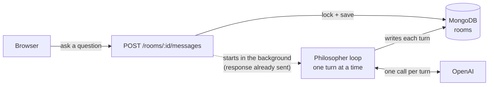
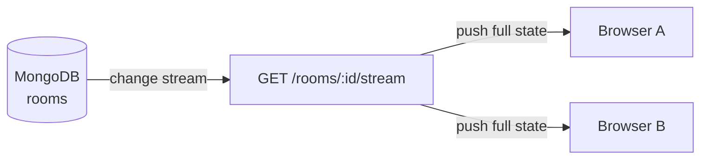

# Symposium

Ask a question. The great thinkers of history will debate it for you, in a shared room — an AI dramatization, not the real philosophers.

## Screenshots

**Home** — ask a question, browse rooms, or jump straight to the founding panel.


**A live debate room** — the question up top, the panel's portraits, and the first round's turns arriving one by one under a numbered round marker.


**Rooms index** — every debate held so far, newest activity first, with turn counts and live status.


**API docs** — the interactive Swagger UI at `/api-docs`, generated from the hand-authored OpenAPI spec (see [API](#api) below).


## The "Anti-Vibe" Engineering

Most AI-generated software is "vibe-coded"—brittle, untested, and impossible to maintain. **Symposium is the opposite.** Every component was built from a comprehensive end-to-end plan, strictly adhering to an architecture that prioritizes refactorability and engineering rigor.

- **Clean Architecture:** The domain core (`lib/`) is entirely decoupled from the framework (Next.js). You can run the entire debate engine, persona logic, and turn-based locking without a browser or a web server.
- **70+ Tests:** A robust suite of unit and integration tests (using `mongodb-memory-server`) ensures that the "Magic" of the AI orchestration is backed by stable, predictable code.
- **AI as a Multiplier, Not a Crutch:** AI tools were used to accelerate development, but the architecture was carefully built to ensure that a human (or another AI) can refactor and extend the project with confidence.

## Architecture

Two flows, kept deliberately separate: asking a question writes to Mongo and kicks off a background round; watching a room just follows whatever Mongo says happened. Everything else in the app — locking, rate limiting, the passcode gate — sits in front of one or the other of these.

**Asking a question**



**Watching a room live**



Every write in the first diagram — locking the room, appending a turn — is a plain `updateOne` on the same Mongo document (`lib/roomRepo.ts`). The second diagram is only possible because of that: `lib/roomStream.ts` watches that one document with a MongoDB change stream, so any number of browsers can open the stream route and each gets pushed the full current state the instant anything changes — no broadcast list to maintain, no polling.

Not pictured, because they wrap both flows the same way rather than living inside either one: `proxy.ts` gates every request behind the shared passcode, and `lib/rateLimit.ts` + `lib/rateLimitRepo.ts` cap `create`, `ask`, and `stream` per-IP against their own Mongo collection.

## How it works

- A room holds a running transcript and a `status` (`idle` / `debating` / `error`).
- Asking a question atomically locks the room and appends your message (`lib/roomRepo.ts`'s `tryAcquireAndAsk` — a single conditional Mongo update, so two concurrent askers can't both start a round).
- The panel speaks in rotation (`lib/round.ts` + `lib/liveRound.ts`): each philosopher's prompt (`lib/prompt.ts`) includes the discussion so far and is explicitly instructed to react to what the others just said, not restate their own position in isolation.
- The room's name starts as a plain truncation of the first question (`lib/roomState.ts`'s `roomNameFallback`, so it's never blank) and is then replaced in the background by a short, editorial-style title the model generates from that question (`lib/roomRepo.ts`'s `generateRoomName`, called from `lib/liveRound.ts`) — best-effort, so a failure there just leaves the plain fallback in place.
- Every viewer's browser holds an SSE connection (`EventSource`) to `GET /api/rooms/:id/stream`, backed by a **MongoDB change stream** on the room's document — the instant a turn is written, every connected viewer gets it pushed over that one live connection. See [Real-time updates](#real-time-updates).
- If a round fails (model timeout, bad key, network), the room is marked `error` and the lock is released — it's askable again immediately, not stuck.
- The whole site sits behind a shared passcode (`proxy.ts`). See [Auth](#auth).

## Project structure

- `lib/` — the domain core. Pure logic (`lib/roster.ts`, `lib/lock.ts`, `lib/rateLimit.ts`, `lib/messages.ts`, `lib/roomState.ts`, `lib/format.ts`) is unit-tested with no infrastructure; Mongo/OpenAI wiring (`lib/roomRepo.ts`, `lib/db.ts`, `lib/openaiClient.ts`, `lib/liveRound.ts`, `lib/roomStream.ts`) sits on top and is integration-tested against a real (in-memory) MongoDB.
- `lib/roster.ts` — the panel's single source of truth: philosopher ids, display names, portrait paths (served from `public/portraits/`) and one-line taglines. Exposed to the client only via `GET /api/panel` (`app/usePanel.ts`) — never hardcoded in JSX.
- `lib/personas/` — one file per philosopher (`nietzsche.ts`, `marx.ts`, `beauvoir.ts`, `foucault.ts`), each a structured `PersonaSpec` (core position, tone, influences, rhetorical moves, things to avoid) assembled into a system prompt by `lib/personas/types.ts`'s `buildPersonaPrompt`.
- `app/api/` — route handlers. Business logic lives in framework-agnostic handlers (`app/api/rooms/handlers.ts`) so it's testable without spinning up Next.js; the `route.ts` files are thin adapters (parsing/validating the request, calling the handler, shaping the response).
- `app/components/Header.tsx` — the masthead rendered at the top of every page (brand, nav, per-page byline). Each page passes its own `meta` line rather than the header living in the root layout, since the byline text differs per screen.
- `app/room/[id]/` — the room UI. `RoomView.tsx` is the client component, grouping the transcript into rounds with a portrait next to each turn; `useRoomStream.ts` owns the `EventSource` subscription and exposes a small `{name, status, messages, canAsk, ask, notFound, connected}` contract, with the actual state-merging logic (`applyStreamResponse`) kept as a pure, separately-tested function.
- `app/rooms/` — lists all rooms (as a sortable table) and lets you start a new one.
- `app/api-docs/` — interactive Swagger UI for the API (see below).

## Running locally

Mongo runs in Docker; Next.js runs natively.

```bash
docker compose up -d      # mongo (replica set) + mongo-express, auto-initiated, no manual step
cp .env.example .env.local  # fill in OPENAI_API_KEY and SITE_PASSCODE
npm install
npm run dev
```

Open [http://localhost:3000](http://localhost:3000).

**Why Mongo needs a replica set even locally**: real-time updates use MongoDB change streams, which require one (see [Real-time updates](#real-time-updates)). `docker compose up` handles this automatically via a one-shot `mongo-init` service — nothing to run by hand. If you ever see `getaddrinfo ENOTFOUND mongo` from the Next.js process, check `MONGODB_URI` still has `directConnection=true` (see `.env.example`) — without it, the driver tries to reach Mongo by its Docker-internal hostname, which your host machine can't resolve.

**mongo-express** (a Mongo GUI) is at [http://localhost:8081](http://localhost:8081) — handy for browsing the `rooms` collection directly.

### Environment variables

| Variable | Purpose |
|---|---|
| `MONGODB_URI` | Connection string. Locally: `mongodb://localhost:27017/symposium?replicaSet=rs0&directConnection=true`. On Atlas, use the connection string Atlas gives you as-is — Atlas clusters are already real replica sets, so no `directConnection` flag is needed there. |
| `OPENAI_API_KEY` | Required. |
| `OPENAI_MODEL` | Optional, defaults to `gpt-4o-mini`. |
| `SITE_PASSCODE` | Required. Shared passcode gating the whole site — see [Auth](#auth). |

## Auth

The whole site sits behind one shared passcode (`proxy.ts`, this Next.js version's replacement for `middleware.ts`) — an MVP-demo door for a handful of people, not real auth. `POST /api/login` checks a submitted passcode against `SITE_PASSCODE` and, on a match, sets an `httpOnly` cookie whose value **is** the passcode; every other request is compared against that cookie, redirecting unauthenticated page loads to `/login` and returning a 401 for unauthenticated API calls. There's no session store, no expiry beyond the cookie's own 30-day `maxAge`, and no signature — anyone who reads the cookie has the actual passcode. `POST /api/logout` clears it.

## Real-time updates

Each browser subscribes to `GET /api/rooms/:id/stream` over Server-Sent Events. The route opens a MongoDB change stream on that one room's document (`lib/roomStream.ts`'s `watchRoom`) and pushes the full current room state to the browser the instant any write lands — asking a question, a philosopher's turn, a status change. Multiple people can watch the same room and all see updates simultaneously, each over their own SSE connection.

This needs Mongo running as a replica set (change streams require an oplog) — Atlas already runs as one in production; locally, `docker-compose.yml`'s `mongo-init` service sets this up automatically. `EventSource` reconnects on its own if a connection drops (a network blip, or — routinely, on Vercel — the function hitting its max execution duration; see [Known limitations](#known-limitations)), so there's no reconnection logic to maintain by hand — a fresh connection just re-sends the current full state.

## Known limitations

**The SSE stream may get force-disconnected periodically on Vercel — worth being ready for, not confirmed as an active problem.** `app/api/rooms/[id]/stream/route.ts` never returns while a client is connected — that's the whole point of an SSE stream — and serverless functions generally have *some* ceiling on how long a single invocation may run. Neither this route's 20s heartbeat nor `EventSource`'s own reconnect logic does anything about that kind of ceiling if it's hit — the heartbeat only stops *idle-timeout* disconnects from intermediary proxies, not a platform-enforced hard limit on the invocation itself.

That said: on the actual deployed app, no disconnect has been observed yet, even on rooms left open a while. So either it isn't happening at the assumed cadence on the current plan/config (Fluid Compute's Active-CPU billing model may treat a mostly-idle stream differently than a flat wall-clock cap), or it's happening and staying invisible by design — every push is a full snapshot rather than a delta (`roomSnapshotFromDoc`), and the client's merge is idempotent (`mergeMessages`, dedupe by index), so a reconnect wouldn't look like anything from the UI. Both are plausible; this hasn't been distinguished yet. Check the Network tab for the `/stream` connection's duration, or Vercel's function logs, before treating this as a real, sized cost rather than a theoretical one.

If it does turn out to matter in practice:
- Set `export const maxDuration` on the stream route explicitly, so the assumption is a documented, deliberate choice rather than whatever the platform's current default happens to be.
- At meaningfully larger scale, move long-lived fan-out off of a per-request serverless function entirely — a serverless function is the wrong primitive for a connection meant to live indefinitely. A small always-on relay process, or a managed realtime/pub-sub service sitting in front of the same Mongo change stream, would remove any reconnect cycle altogether instead of just tolerating it gracefully.
- Track concurrent open change-stream cursors (there's currently no visibility into this beyond Atlas's own connection-count metrics) before assuming the churn — if it exists at all — is free.

## Rate limiting

Creating a room and asking a question are both capped per-IP (fixed-window, `lib/rateLimit.ts` + `lib/rateLimitRepo.ts`, enforced Mongo-atomically to avoid races) — 40/hour each by default. Asking costs 4 model calls per round, so this is mainly a cost control. A 429 response includes `Retry-After`, and the client surfaces it (`lib/format.ts`'s `retryAfterSuffix`) instead of a generic "try again" message.

The SSE stream endpoint is separately capped at 120/hour per IP — generous, since reconnects count against it too. A 429 there isn't valid SSE, so instead of a bare error the server sends a `rate_limited` event and closes; the client (`app/room/[id]/useRoomStream.ts`) shows that state and schedules its own reconnect after the given `Retry-After`, rather than either hanging silently or having the browser's native reconnect hammer the endpoint.

**How the limiter actually works.** It's a fixed window, not a sliding window or token bucket. Each action is tracked by a key like `ask:73.44.x.x` (`action:ip`) in a `rateLimits` collection, and every request does exactly one atomic `findOneAndUpdate` on that key (`lib/rateLimitRepo.ts`'s `bumpRateLimit`) — no separate read-then-write, so two concurrent requests from the same IP can't both read a stale count and both slip through:
- No window yet, or the existing one started more than an hour ago → start a fresh window: `windowStart = now`, `count = 1`.
- Otherwise → same window, `count += 1`.

If `count` exceeds the limit, the request is blocked, and `retryAfterSec` is *that window's remaining time*, not a flat hour — so you're never stuck waiting longer than necessary. The tradeoff of fixed (vs. sliding) windows is the classic one: a burst right at a window boundary could briefly allow close to double the intended rate. That's an acceptable tradeoff here — this exists to cap real OpenAI spend on a small shared demo, not to abuse-proof a public API. Each rate-limit doc sets its own `expiresAt` at 2× the window and `lib/db.ts` creates a TTL index on it, so old windows just age out of Mongo on their own.

Locally, all three limits share one bucket per action (`ipAddress()` from `@vercel/functions` returns `undefined` outside Vercel, so every request maps to the same `"unknown"` IP) — on a real deploy each visitor gets their own.

## Testing

```bash
npm test          # run once
npm run test:watch
```

**Why there's this much test coverage for a small app.** Most of this codebase has been built and modified by AI coding agents, often across separate sessions touching the same files. A thorough suite is what lets an agent (or a human) change `lib/roomRepo.ts`'s locking, `lib/round.ts`'s speaking order, or the rate limiter and actually know within seconds whether something else broke — instead of that only surfacing later, live, in a way that's harder to trace back to the change that caused it. That said, tests catch regressions in logic, not everything — see the note right below on what still has to be checked live.

Pure logic is tested with no infrastructure. Anything touching Mongo (locking, rate limiting, change streams) is tested against a real, in-memory MongoDB via `mongodb-memory-server` — plain operations use `MongoMemoryServer`; change streams need `MongoMemoryReplSet` (a real oplog), since change streams don't work against a non-replica-set instance.

**A green test suite isn't the same as a working app.** Verify changes live against the running dev server too — curl the affected endpoint, or click through the actual flow in a browser — not just `npm test`. Several real bugs here (a MongoDB aggregation `$eq`-vs-missing-field gotcha, a client-side hardcoded-speaker-names bug, a few 404-vs-500 status code mismatches, and an SSE rate-limit response that silently broke `EventSource` without ever failing a test) all passed the full suite and only surfaced when actually exercised end to end. After any change touching Mongo queries, API status codes, or the SSE stream, check it live before calling it done.

## API

Interactive docs: [http://localhost:3000/api-docs](http://localhost:3000/api-docs) (Swagger UI), backed by the hand-authored OpenAPI spec at `/api/openapi.json`.

| Endpoint | Purpose |
|---|---|
| `POST /api/rooms` | Create a room |
| `GET /api/rooms` | List rooms (summaries, newest-active-first) |
| `GET /api/rooms/:id` | One-shot room snapshot, optionally `?since=` an index |
| `GET /api/rooms/:id/stream` | Live updates via SSE (see above) |
| `POST /api/rooms/:id/messages` | Ask the panel a question |

## Roadmap

### 1. Pick Your Panel

Expand beyond the founding four, including Plato, Hume, Kant, Freud, and others, and allow users to choose which thinkers participate in a debate.

### 2. From Round-Robin to Hot-Seat

The current speaking order is fixed and precomputed (`lib/roster.ts`'s `speakingOrder`, walked by `lib/round.ts`'s `runRound` — see the `TODO` there). The next step is a dynamic moderator that decides who should respond based on how strongly a position has been challenged, allowing participants to interject or double down rather than simply waiting their turn.

This will likely require a more sophisticated orchestration layer, potentially using a framework such as LangGraph.

### 3. Deeper Discussion

The goal: a deeper, more critical discussion, not just more back-and-forth. Every speaker already has to engage with everyone who has spoken during the round, not just the previous speaker (`lib/prompt.ts`'s `buildTurnMessages`) — the next step is making that engagement sharper, not just present. Have each persona privately critique the previous argument's logic before writing their public response, so replies engage with what was actually said instead of just its tone.
